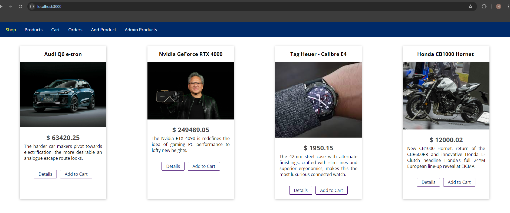
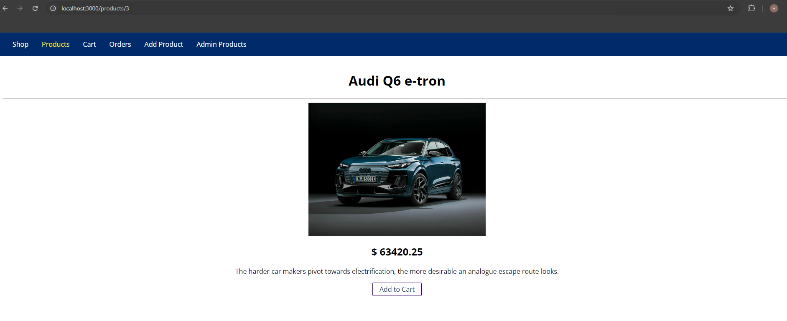
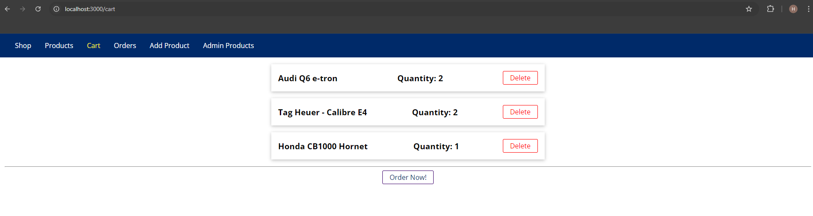
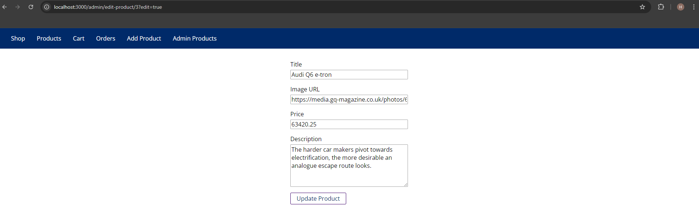

# Node JS Online Shop  
## live view: <a href="https://node-js-online-shop.onrender.com" target="_blank">node-js-online-shop.onrender.com</a>
### Platform: Node JS  
### Framwork: Express  
### Database: MongoDB  
### ORM: Mongoose  

**node_module isn't uploaded.**  
**Requesting to run _'npm install'_ command to intall related node dependencies.**   

## Screenshots:
Home:  

Products:  

Product Dtails:  

Cart:  

Orders:  

Add Product:  

Admin Products:  

Edit Products:  

