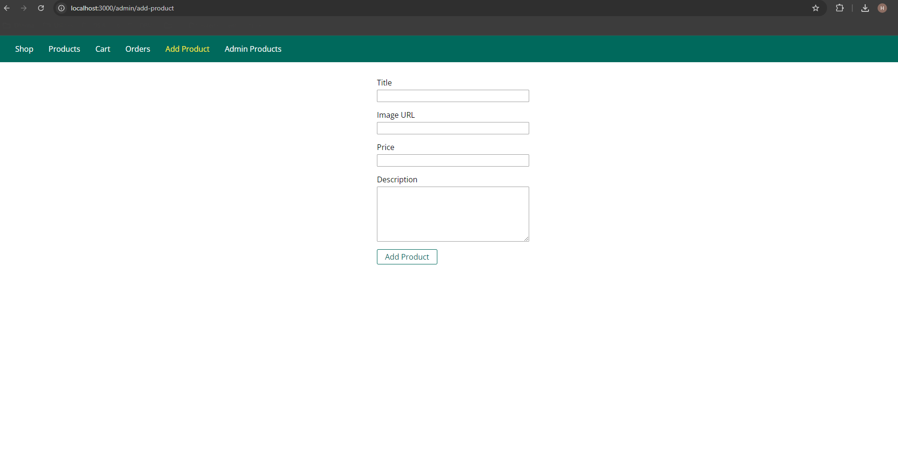

# Online shop using Node JS and Express JS  
**node_module isn't uploaded.**  
**Requesting to run _'npm install'_ command to intall related node dependencies.**  

## Screenshots:
Home:  

Cart:  

Products:  

Product Dtails:  

Add Product:  

Admin Products:  

